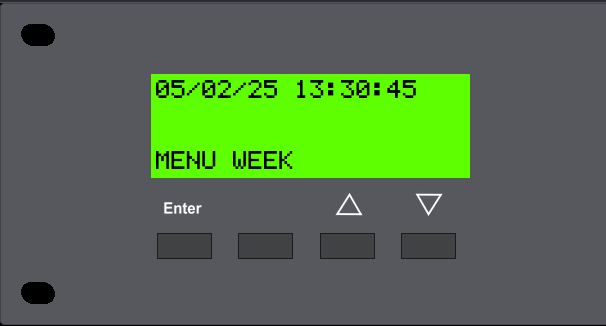
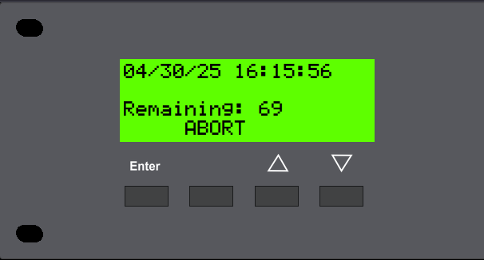

# SAGE-WRM (SAGE Web Remote)
 Control a SAGE Endec from a simple webpage

   
<br />

# Developer Notes
 This is one of my side projects, meaning it might not be updated frequently. SAGE-WRM is just a software tool for hobbyists using SAGE Equipment. NEVER should you ever port forward or open this software to the internet. There is NO password protection! 
\
\
**I am not responsible for any damages caused by this software!**

## Release Notes
- 7/21/2023 - Initial release.
- 5/2/2025  - Web Frontend revised. (Big thanks to [clabretro](https://youtu.be/W7m7OW2xrJE?t=1572) for giving me inspiration for the new UI.)
<br />

## How Does it work?
 SAGE-WRM leverages a COM port on the SAGE Endec, configured for "Hand Control," to emulate certain functions of an official RC-1 Remote. This emulation is then presented on a webpage.

<br />

# Installation 

## Hardware Requirements
 Obviously, you will need a SAGE EAS Endec, either a 1822 [tested] or 3644 [not tested] and method to receive and send the serial data to and from the SAGE, preferably a USB to serial adapter.

## Software Requirements
 SAGE-WRM was developed with Python 3.12.2 but any version higher than 3.10 should work. Also, Windows should work with SAGE-WRM. A few libraries will need to be installed via pip for SAGE-WRM to work.
\
 ```bash
 pip install pyserial pyramid waitress
 ```

## Setup
 After downloading the repository and saving it to a location you will need to edit the `config.json` file.
\
In the config file both `serial_port` and `serial_port_baud` should be set to the device connected to the correct COM port on the SAGE Endec that is set to Hand Control. Depending on the application, `webserver_host` and `webserver_port` most likely can stay at their default values.

## Starting SAGE-WRM
 Linux:
 ```bash
 python3 WRM.py
 ```
 Windows:
 ```bash
 py WRM.py
 ```
 or
  ```bash
 python WRM.py
 ```
\
To Access the Webpage go to:
```
http://machine_IP:8080/
```